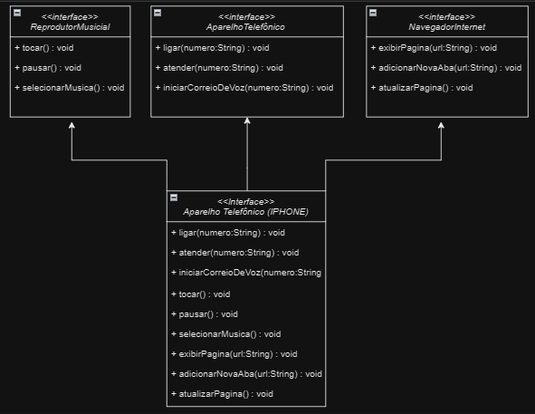

# 📂 Desafio Diagramação de classes do iPhone - DIO

## 📃 Projeto desenvolvido para resolução do desafio de modelagem de software apresentado na plataforma DIO

 

## 🚀 Tecnologias

- Java
- Modelagem e diagramação em UML
- Git e Github

 

## Objetivo

Apresentar as funcionalidades de um iPhone utilizando princípios de programação orientada a objetos e técnicas de modelagem UML para criar estrutura de um celular iPhone que desempenhe três papéis: Reprodutor Musical, Aparelho Telefônico e Navegador na Internet.

## 📊 Diagrama UML

  

### `iPhone`

A classe `iPhone` é a classe principal que representa o dispositivo. E implementa as interfaces `ReprodutorMusical`, `AparelhoTelefonico` e `NavegadorInternet`. Isso permite que o iPhone desempenhe os papéis de reprodutor musical, aparelho telefônico e navegador na Internet.

### `ReprodutorMusical`

A interface `ReprodutorMusical` define os métodos necessários para controlar a reprodução de música, como `tocar()`, `pausar()` e `selecionarMusica()`. As classes que implementam essa interface são capazes de reproduzir músicas.

### `AparelhoTelefonico`

A interface `AparelhoTelefonico` define os métodos para realizar chamadas telefônicas e enviar mensagens, incluindo `ligar()`, `atender()` e `iniciarCorreioVoz()`. As classes que implementam essa interface podem funcionar como dispositivos telefônicos.

### `NavegadorInternet`

A interface `NavegadorInternet` define métodos para a navegação na web, como `exibirPagina()`, `adicionarNovaAba()` e `atualizarPagina()`. As classes que implementam essa interface podem atuar como navegadores da Internet.

Cada classe ou interface desempenha um papel específico no sistema e contribui para a versatilidade do dispositivo iPhone, tornando-o capaz de realizar uma variedade de funções.

---
---
## 📧 Contato
[LinkedIn](https://www.linkedin.com/in/wsawebmaster/)

wsawebmaster@yahoo.com.br
